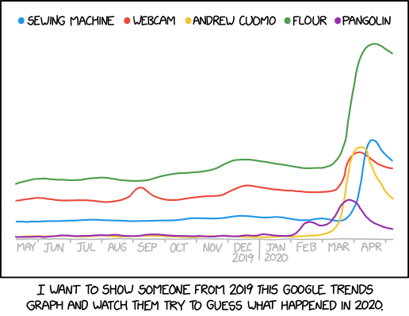

# The Trendlist Project

This repository is source code for the *Trendlist* project.
It builds the *trendlist* package, which includes the submodule *trendlist.simple*.

 <!--- https://imgs.xkcd.com/comics/2020_google_trends.png --->

## What are Trends?

### Background: Monotonic Sequences Are Well-Defined and Rare.

If you sort a set of numbers, every element is greater than its neighbor to the left.
A math geek would call such a sequence, *monotonically increasing*.
Monotonic can mean any of these.

Some examples:

* monotonically increasing: 1, 2, 4, 8, 16, ...
* monotonically decreasing: -1, -3, -9, -27, ...
* monotonically non-decreasing: 1, 1, 2, 3, 5, 8, ...
* monotonically non-increasing: 1, 1, 1/2, 1/3, 1/5, 1/8, ...

For simplicity, let's focus on the sorted (monotonically increasing) sequences, understanding that we can go back and reason analogously about the other three types.

Few real-world sequences are sorted, but lots get generally bigger from one end to the other.

Can we relax monotonicity in an interesting way to let us include those, too?
Let's give it a shot.

### Trends Are a Generalization of Monotonic Sequences.

Let's start with a different, but equivalent definition of sorted.

With a sorted sequence, if you put your finger between any two sequence elements, everything to the left of your finger is less than everything to the right.

Suppose, instead, when put your finger between any two sequence elements,
the *average* of everything to the left of your finger is less than the *average* of everything to the right.

Let's call that a *trend*.

Trends are a superset:
that is, a sorted sequence is a trend
but a trend doesn't have to be sorted.

For example, `1, 2, 4, 8, 16` is both sorted and a trend,
but `2, 1, 4, 8, 16` is not sorted, yet it is a trend.
* `mean(2) = 2 < mean(1, 4, 8) = 13/3`
* `mean(2, 1) = 3/2 < mean(4, 8) = 6`
* `mean(2, 1, 4) = 7/3 < mean(8) = 8`

So are `4, 1, 2, 8, 16` and fourteen other permutations of the set `{1, 2, 4, 8, 16}`

Though not everything is a trend, trends are far more common than monotonically increasing sequences.

They're also interesting.

### We Use the Arithmetic Mean for Averages

The average most of us use for most things is the arithmetic mean: the sum divided by the number of elements.
`mean([1, 2, 4, 8]) = (1+2+4+8)/4 = 15/4`

For defining trends, any average will work that satisfies one condition:
if `S1` and `S2` are sequences, and `Average(S1) < Average(S2)`, then
`Average(S1) < Average(S1 + S2) < Average(S2)`.

Geometric and harmonic means both satisfy this condition, too, as so some other even-more-obscure measures of central tendency,
but right now, the package hard-wires "average" to "arithmetic mean."

**TODO: Enhancing *trendlist*,
so you can specify the average to use in a config file,
would be a useful upgrade.**

### We Use Python Floats for Reals

If you're a mathematician, you can say things like, *"The probability that two random reals, independently chosen on a finite interval, are equal has Lebesgue measure zero."*
with a straight face.

This means that if you had a true random number generator, and generated a snotload of random floats, no two would ever be the same.

In Python, `random()` returns floats in `[0, 1)` that are random enough, and have enough digits,
that this package treats them like reals and pretends it'll never throw out duplicates.

The code nods to reality by throwing an exception if it notices a violation of this assumption.
It hasn't yet.

**TODO: Specifying the random-number generator in a config file
would be a useful enhancement.**

### Two Utilities: rands() and powers()

The `trendlist` package supplies two utilities for convenience: `rands()`
which generates lists of random floats,
and `pows`, which returns lists of powers of two
(`[1, 2, 4, 8, ...]`).

Both are useful for writing code to explore and illustrate trends.

**TODO: I've assumed averages of two different random sequences of reals
are never the same. (*"...Lebesgue measure zero"*).
I would welcome a proof.**

**TODO: I believe the same about subsets of powers of primes.
Again, a proof would be nice.**

### We Build Classes to Represent Trends and TrendLists

The submodule *trendlist.simple* represents trends as lists, and lists of trends as lists of lists.
This is a simple, and instructive way to play with trends and trendlists, but it's a pig.
It's not worth waiting for the module to turn a sequences of a thousand random floats into a trendlist.

Instead, the *trendlist* module supplies a second, more efficient approach for bigger problems, built on a simple observation:
when you tack two trends together, their combined average is a weighted average of the pair.

For example,
a rising trend with length `6` and mean `4.0`
followed by
a rising trend with length `2` and mean `8.0`,
will combine to form a single, rising trend of length `8`
and mean `(6*4.0 + 2*8.0)/8 = 40.0/8 = 5`.

Almost no operations with trends require storing
the actual, `s_i` values that make up the trend;
it's enough to keep track of the trend mean and trend length.
The `trendlist` package defines the objects of `class Trend`, which only stores these two values.
a second class, `TrendList`, a subclass of `List`, represents lists of `Trend` objects.

Simplifying in this way gives us back reasonable performance.
You can use these abstractions turn a sequence of a million random floats into a TrendList in a second or two.

### Trends Have Cool Properties

It's pretty obvious that any sequence breaks cleanly and uniquely into maximum-length, monotonically increasing subsequences. For example,

* `[3, 1, 4, 1, 5, 9]`  -> `[[3], [1 4], [1 5 9]]`

* `[2, 7, 1, 8, 2, 8, 1, 8, 2, 8, 4, 5, 9, 0, 4, 5]` -> `[[2, 7], [1, 8], [2, 8], [1, 8], [2, 8], [4, 5, 9], [0, 4, 5]]`

We're letting single numbers be monotonic sequences, where needed, and we're excluding sequences with adjacent, repeating numbers, like `[1, 1, 2, 3, 5, 8, 13]`

The monotonic subsequences are called "ascents," and were studied in depth by Euler who probably called them something else because he was German and wrote in Latin.

Notice a couple of things:

* The last number of an ascent is always greater than the first number of the next,

* Out of the `N!` permutations of a set of N numbers, only one -- the list after sorting -- is monotonically increasing.

Pleasantly, every sequence also breaks cleanly and uniquely into maximum-length trends.

* `[3, 1, 4, 1, 5, 9]`  -> `[[3, 1, 4, 1, 5, 9]]`

* `[2, 7, 1, 8, 2, 8, 1, 8, 2, 8, 4, 5, 9, 0, 4, 5]` -> `[[2, 7, 1, 8, 2, 8, 1, 8, 2, 8, 4, 5, 9], [0, 4, 5]]`

Spoiler alert:

- The means of the trends decrease monotonically. Every trend's mean is greater than the one to its right.

- Out of the `N!` permutations of a set of `N` numbers, `(N-1)!` are single trends.
In fact, every sequence has exactly one circular permutation that's a single, increasing trend.

These perhaps-not-intuitively-obvious properties, along with many other cool things,
are proved in Ehrenfeucht, *et al. (vide infra)*.

### A Sketch of the Development Environment

I use `poetry` for environment and dependency management.
The file `pyproject.toml` contains specifications.

The code is linted with `isort` `black`, `flake8`, `mypy`, `bandit`, and `safety`, and tested with `pytest`. 
The test suite provides 100% code coverage, and is tested with `mutmut`.
Configuration, settings, and plugins for tools are defined in `pyproject.toml`.

The tools themselves are documented at <https://readthedocs.io> under *toolname*.readthedocs.io ,
except `safety`, which is documented at <https://pyup.io/safety>

**TODO: I'd welcome suggestions on what other checks I should add.**

### There's Plenty of Documentation

In addition to this README, the *trendlist* package is documented at [`readthedocs.io`](https://trendlist.readthedocs.io/en/latest/index.html).

There is [a repository of jupyter-notebook tutorials](https://github.com/jsh/trendlist-notebooks),
which you can clone yourself or bring up in [a binder container](https://mybinder.org/v2/gh/jsh/trendlist-notebooks.git/HEAD) either through the link here, or by clicking on the `binder` badge in the GitHub repository.

## Reference
[Andrzej Ehrenfeucht, Jeffrey Haemer, and David Haussler Quasi-Monotonic Sequences: Theory, Algorithms and Applications. SIAM. J. on Algebraic and Discrete Methods 1987;8(3):410-429](https://scholar.colorado.edu/downloads/8049g581k)
